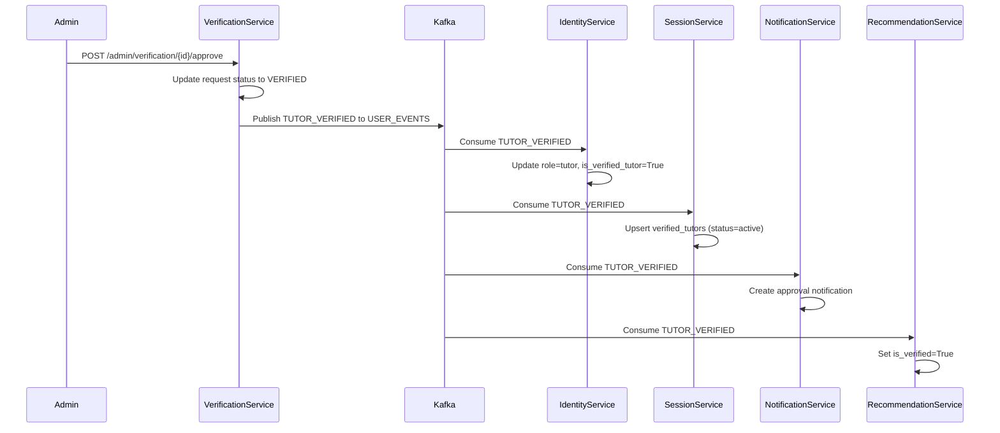
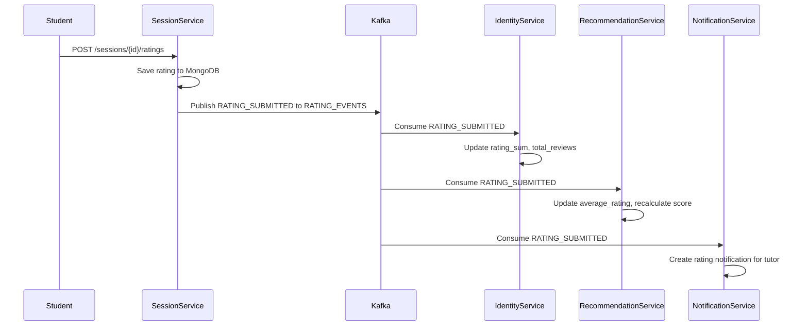

# StudySync — Kafka Architecture Guide

## Why Kafka Exists

StudySync uses Apache Kafka as its asynchronous event bus to decouple microservices and enable eventual consistency across service boundaries. Kafka solves several critical requirements:

1. **Service Independence** — Services don't need to be available simultaneously. A service can publish events and continue operating even if consumers are down.
2. **Eventual Consistency** — State changes propagate asynchronously, avoiding distributed transactions (2PC) while maintaining data integrity.
3. **Resilience** — Kafka provides durable storage, replay capability, and consumer group rebalancing.
4. **Scalability** — Consumer groups allow horizontal scaling of event processing.
5. **Audit Trail** — Kafka topics serve as an immutable event log for all state changes.

## Event-Driven Design

StudySync follows an event-driven architecture where services communicate state changes through Kafka topics rather than direct HTTP calls. This ensures:

- **No cascading failures** — A downstream service failure doesn't impact upstream services
- **Decoupled deployments** — Services can be deployed independently
- **Easy extension** — New consumers can subscribe to existing topics without modifying producers

### Event Flow Pattern

```
Service A (Producer)
  → Performs local DB operation
  → Publishes event to Kafka topic
  → Returns success to client (no synchronous dependency on consumers)

Kafka Topic (Durable Storage)
  → Events persisted based on retention policy
  → Consumer groups track offsets independently

Service B (Consumer)
  → Processes event asynchronously
  → Updates local read model
  → Idempotent processing (duplicate-safe)
```

## Kafka Resilience Architecture

Every Kafka-producing service implements a consistent resilience pattern:

```
ResilientKafkaProducer
  publish(topic, value, key)
    │
    ▼
  CircuitBreaker.allow_request()?
    │ YES              │ NO (OPEN)
    ▼                  ▼
  Send to Kafka    InMemoryFallbackStore.put()
    │ SUCCESS
    ▼
  CircuitBreaker.record_success()
    │ FAILURE
    ▼
  CircuitBreaker.record_failure()
  InMemoryFallbackStore.put()

KafkaRetryWorker (background asyncio task)
  → polls fallback store every 1s
  → retries with exponential backoff
  → base_delay: 2s, max_delay: 30s
```

### Circuit Breaker States

| State | Behavior |
|-------|----------|
| CLOSED | Normal operation — all requests pass through to Kafka |
| OPEN | Kafka unreachable — all events go to in-memory fallback store |
| HALF_OPEN | One probe request allowed; success → CLOSED, failure → OPEN |

### Failure Scenarios

| Scenario | Behavior | Recovery |
|----------|----------|----------|
| Kafka broker down | Circuit opens, events queued in memory | Retry worker drains queue when Kafka returns |
| Kafka startup timeout | Service starts without producer | Retry worker attempts reconnection |
| Network partition | Events buffered locally | Automatic retry with backoff |
| Consumer offline | Events remain in Kafka | Consumer resumes from last committed offset |

## Topic Inventory

### 1. `USER_EVENTS`

**Purpose:** Propagate user identity and tutor verification state changes.

| Attribute | Value |
|-----------|-------|
| Partition Count | 1 (default) |
| Replication Factor | 1 |
| Retention | Default (7 days) |

#### Events

| Event | Producer | Consumers | Trigger |
|-------|----------|-----------|---------|
| USER_CREATED | Identity Service | Notification Service | User registration |
| EMAIL_VERIFICATION_SENT | Identity Service | (Future) | Email verification request |
| TUTOR_VERIFIED | Identity Service, Verification Service | Identity Service, Session Service, Notification Service, Recommendation Service | Admin approves tutor verification |
| TUTOR_REJECTED | Verification Service | Identity Service, Session Service, Notification Service, Recommendation Service | Admin rejects tutor verification |
| TUTOR_SUSPENDED | (Future) | Identity Service, Session Service | Admin suspends tutor |

#### Payload Schema

```json
{
  "event_type": "USER_CREATED",
  "user_id": "uuid",
  "email": "user@example.com",
  "role": "user"
}
```

```json
{
  "event_type": "TUTOR_VERIFIED",
  "user_id": "uuid",
  "verificationRequestId": "uuid",
  "status": "VERIFIED",
  "timestamp": "2026-05-28T20:00:00Z"
}
```

```json
{
  "event_type": "TUTOR_REJECTED",
  "user_id": "uuid",
  "verificationRequestId": "uuid",
  "reason": "Documents did not meet requirements",
  "status": "REJECTED",
  "timestamp": "2026-05-28T20:00:00Z"
}
```

---

### 2. `RATING_EVENTS`

**Purpose:** Propagate rating submissions to update tutor scores across services.

| Attribute | Value |
|-----------|-------|
| Partition Count | 1 (default) |
| Replication Factor | 1 |
| Retention | Default (7 days) |

#### Events

| Event | Producer | Consumers | Trigger |
|-------|----------|-----------|---------|
| RATING_SUBMITTED | Session Service | Identity Service, Recommendation Service, Notification Service | Student submits rating for completed session |
| SESSION_RATED | Session Service | Identity Service, Recommendation Service | Alias for RATING_SUBMITTED |

#### Payload Schema

```json
{
  "event_type": "RATING_SUBMITTED",
  "session_id": "uuid",
  "tutor_id": "uuid",
  "student_id": "uuid",
  "score": 5,
  "tutorId": "uuid",
  "studentId": "uuid"
}
```

#### Consumer Actions

| Consumer | Action |
|----------|--------|
| Identity Service | Increments `rating_sum` and `total_reviews` in tutor_profiles |
| Recommendation Service | Updates `average_rating`, recalculates recommendation score |
| Notification Service | Creates notification about new rating |

#### Duplicate Detection (Identity Service)

Redis-based deduplication using `rating_event:{session_id}:{student_id}` key with 24-hour TTL.

---

### 3. `GROUP_EVENTS`

**Purpose:** Propagate group lifecycle changes to sync membership across services.

| Attribute | Value |
|-----------|-------|
| Partition Count | 1 (default) |
| Replication Factor | 1 |
| Retention | Default (7 days) |

#### Events

| Event | Producer | Consumers | Trigger |
|-------|----------|-----------|---------|
| GROUP_CREATED | Group Service | Chat Service, Notification Service | Group created |
| GROUP_DELETED | Group Service | Chat Service | Group deleted |
| USER_JOINED_GROUP | Group Service | Chat Service, Notification Service | User joins group |
| USER_LEFT_GROUP | Group Service | Chat Service | User leaves group |

#### Payload Schema

```json
{
  "event_type": "GROUP_CREATED",
  "group_id": "uuid",
  "owner_id": "uuid",
  "name": "Calculus Study Group"
}
```

```json
{
  "event_type": "USER_JOINED_GROUP",
  "group_id": "uuid",
  "user_id": "uuid",
  "role": "member"
}
```

```json
{
  "event_type": "USER_LEFT_GROUP",
  "group_id": "uuid",
  "user_id": "uuid"
}
```

#### Consumer Actions

| Consumer | Action |
|----------|--------|
| Chat Service | Upserts/deactivates membership in local MongoDB mirror |
| Notification Service | Creates notification about group events |

---

### 4. `PAYMENT_EVENTS`

**Purpose:** Propagate payment lifecycle state changes.

| Attribute | Value |
|-----------|-------|
| Partition Count | 1 (default) |
| Replication Factor | 1 |
| Retention | Default (7 days) |

#### Events

| Event | Producer | Consumers | Trigger |
|-------|----------|-----------|---------|
| PAYMENT_SUCCESS | Payment Service | Session Service, Notification Service | Payment confirmed |
| PAYMENT_FAILED | Payment Service | Notification Service | Payment failed |

#### Payload Schema

```json
{
  "event_type": "PAYMENT_SUCCESS",
  "payment_id": "uuid",
  "session_id": "uuid",
  "student_id": "uuid",
  "tutor_id": "uuid",
  "amount": 50.00
}
```

```json
{
  "event_type": "PAYMENT_FAILED",
  "payment_id": "uuid",
  "session_id": "uuid",
  "student_id": "uuid",
  "reason": "Insufficient funds"
}
```

#### Consumer Actions

| Consumer | Action |
|----------|--------|
| Session Service | Adds student to session participants (for paid sessions) |
| Notification Service | Creates notification about payment status |

---

### 5. `VERIFICATION_EVENTS`

**Purpose:** Propagate tutor verification application and document status.

| Attribute | Value |
|-----------|-------|
| Partition Count | 1 (default) |
| Replication Factor | 1 |
| Retention | Default (7 days) |

#### Events

| Event | Producer | Consumers | Trigger |
|-------|----------|-----------|---------|
| TUTOR_APPLICATION_SUBMITTED | Identity Service | Verification Service, Session Service | Tutor submits application with documents |
| VERIFICATION_SUBMITTED | Verification Service | Notification Service | Verification request submitted |
| VERIFICATION_APPROVED | Verification Service | Notification Service | Admin approves verification |
| VERIFICATION_REJECTED | Verification Service | Notification Service | Admin rejects verification |

#### Payload Schema

```json
{
  "event": "TUTOR_APPLICATION_SUBMITTED",
  "userId": "uuid",
  "bio": "Experienced math tutor...",
  "subjects": ["mathematics", "physics"],
  "hourly_rate": "25.00",
  "documents": [
    {
      "document_type": "IDENTITY_PROOF",
      "file_name": "passport.jpg",
      "file_url": "{user_id}/identity_proof/{uuid}.jpg"
    },
    {
      "document_type": "HIGHEST_DEGREE",
      "file_name": "degree.pdf",
      "file_url": "{user_id}/highest_degree/{uuid}.pdf"
    }
  ],
  "status": "PENDING"
}
```

#### Consumer Actions

| Consumer | Action |
|----------|--------|
| Verification Service | Creates TutorVerificationRequest and VerificationDocument records |
| Session Service | Upserts pending record for free session creation |
| Notification Service | Creates notification about verification status |

---

### 6. `CHAT_EVENTS`

**Purpose:** Propagate chat message events for notification and analytics.

| Attribute | Value |
|-----------|-------|
| Partition Count | 1 (default) |
| Replication Factor | 1 |
| Retention | Default (7 days) |

#### Events

| Event | Producer | Consumers | Trigger |
|-------|----------|-----------|---------|
| CHAT_MESSAGE_SENT | Chat Service | Notification Service | Message sent in group |
| CHAT_MESSAGE_DELETED | Chat Service | (Future) | Message deleted |

#### Consumer Actions

| Consumer | Action |
|----------|--------|
| Notification Service | Creates notification for offline group members |

---

### 7. `ADMIN_EVENTS`

**Purpose:** Propagate admin actions for audit and notification.

| Attribute | Value |
|-----------|-------|
| Partition Count | 1 (default) |
| Replication Factor | 1 |
| Retention | Default (7 days) |

#### Events

| Event | Producer | Consumers | Trigger |
|-------|----------|-----------|---------|
| Admin lifecycle events | Admin Service | (Future) | Admin CRUD operations |

---

## Kafka Configuration

### Consumer Settings (Per Service)

| Setting | Identity Service | Session Service | Chat Service | Notification Service |
|---------|-----------------|----------------|--------------|---------------------|
| Client ID | identity-service | session-service | chat-service | notification-service |
| Consumer Group | identity-service-ratings | session-service-group | chat-service-group | notification-service |
| Auto Offset Reset | earliest | earliest | earliest | earliest |
| Enable Auto Commit | true | true | true | true |
| Session Timeout | 30s | 30s | 30s | 30s |
| Heartbeat Interval | 3s | 3s | 3s | 3s |

### Producer Settings

| Setting | Value |
|---------|-------|
| Compression | gzip (Payment Service) |
| Idempotence | enabled (Payment Service) |
| ACKs | all (Payment Service) |
| Linger | 10ms (Payment Service) |

### Retry Configuration

| Setting | Default Value |
|---------|---------------|
| Startup Max Retries | 5 |
| Startup Retry Delay | 3s |
| Startup Timeout | 10s |
| Circuit Breaker Failure Threshold | 3 |
| Circuit Breaker Recovery Timeout | 30s |
| Retry Base Delay | 2s |
| Retry Max Delay | 30s |

---

## Topic Lifecycle

Topics are **not auto-created** by the application code. They must be created manually or via Docker Compose initialization scripts. The current setup relies on Kafka's `auto.create.topics.enable` (default: true) for development.

For production:
```bash
kafka-topics --bootstrap-server localhost:9092 --create --topic USER_EVENTS --partitions 3 --replication-factor 2
kafka-topics --bootstrap-server localhost:9092 --create --topic RATING_EVENTS --partitions 3 --replication-factor 2
kafka-topics --bootstrap-server localhost:9092 --create --topic GROUP_EVENTS --partitions 3 --replication-factor 2
kafka-topics --bootstrap-server localhost:9092 --create --topic PAYMENT_EVENTS --partitions 3 --replication-factor 2
kafka-topics --bootstrap-server localhost:9092 --create --topic VERIFICATION_EVENTS --partitions 3 --replication-factor 2
kafka-topics --bootstrap-server localhost:9092 --create --topic CHAT_EVENTS --partitions 3 --replication-factor 2
kafka-topics --bootstrap-server localhost:9092 --create --topic ADMIN_EVENTS --partitions 3 --replication-factor 2
```

---

## Monitoring & Observability

### Health Endpoints

| Service | Endpoint | Returns |
|---------|----------|---------|
| Identity Service | GET /health/kafka | Circuit breaker state, fallback queue size |
| Session Service | GET /health/ready | Kafka enabled status |
| Admin Service | GET /health/kafka | Circuit breaker state, fallback queue size |
| Verification Service | GET /health/kafka | Kafka connected status |

### Key Metrics to Monitor

- `circuit_breaker` state (closed/open/half_open)
- `fallback_queue_size` (pending events waiting for retry)
- Consumer lag per consumer group
- Produce/consume error rates
- Startup retry attempts

---

## Sequence: Event Flow Examples

### Tutor Verification Flow



### Rating Flow



### Group Membership Sync Flow

```mermaid
sequenceDiagram
    participant User
    participant GroupService
    participant Kafka
    participant ChatService
    participant NotificationService

    User->>GroupService: POST /groups/{id}/join
    GroupService->>GroupService: Insert group_member in PostgreSQL
    GroupService->>Kafka: Publish USER_JOINED_GROUP to GROUP_EVENTS
    
    Kafka->>ChatService: Consume USER_JOINED_GROUP
    ChatService->>ChatService: Upsert membership in MongoDB mirror
    
    Kafka->>NotificationService: Consume USER_JOINED_GROUP
    NotificationService->>NotificationService: Create group join notification