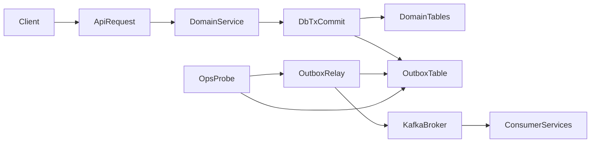

# Kafka Resilience Rollout Guide (Production)

## Goal

Implement production-grade Kafka reliability across all services so that:

- services start even when Kafka is unavailable,
- no critical events are silently lost,
- event delivery is eventually consistent and observable,
- request-path availability is decoupled from broker availability.

This guide applies to:

- `identity_service`
- `group_service`
- `session_service`

---

## Why Current Behavior Needs Change

Current code paths in multiple services initialize Kafka producers during app startup and/or require a live producer in request handlers. This causes two production risks:

- startup failures when Kafka DNS/bootstrap is temporarily unavailable,
- API write failures (`503`) even when local DB writes could succeed.

For production, availability and durability should be handled separately:

- **Availability:** API should remain up.
- **Durability:** events should be persisted and retried until delivered.

---

## Target Architecture

### Core Pattern: Transactional Outbox

Each service stores outbound events in its own database transaction together with domain data changes. A background relay publishes pending outbox rows to Kafka.



### Operational Contract

- Request handlers do **not** require a live Kafka producer.
- Outbox rows are durable before request success is returned.
- Relay retries failed publish attempts with exponential backoff + jitter.
- Consumer side remains idempotent (dedupe by `event_id` where needed).

---

## Event Model Standard

Use a shared event envelope across services:

- `event_id` (UUID, unique)
- `event_type` (e.g., `TUTOR_VERIFIED`, `RATING_SUBMITTED`)
- `aggregate_type` (e.g., `tutor_profile`, `group`, `rating`)
- `aggregate_id` (UUID/string)
- `occurred_at` (UTC timestamp)
- `schema_version` (integer)
- `payload` (JSON)
- `headers` (optional JSON, tracing/correlation metadata)

Recommended producer semantics:

- Kafka key: stable aggregate key (e.g., `user_id`, `group_id`, `tutor_id`)
- Delivery ack: wait for broker ack in relay
- Retry policy: bounded exponential backoff + jitter

---

## Service Connectivity Workflow (End-to-End)

## 1) Identity Service Flow

Example: admin verifies tutor.

1. API verifies admin key and updates tutor profile.
2. Same DB transaction inserts outbox event (`TUTOR_VERIFIED`).
3. API returns success after DB commit.
4. Identity relay picks pending outbox row and publishes to `USER_EVENTS`.
5. Session consumer processes event and updates local verified tutor read model.

Result: identity stays up even if Kafka is down; event is published when broker returns.

## 2) Session Service Flow

Example: participant submits rating.

1. API validates session state and stores rating in Mongo.
2. Same write unit stores outbox event (`RATING_SUBMITTED`) in session outbox.
3. API returns success after persistence.
4. Session relay publishes to `RATING_EVENTS`.
5. Identity consumer updates tutor aggregate (`rating_sum`, `total_reviews`).

Result: no synchronous broker dependency in rating endpoint.

## 3) Group Service Flow

Example: user joins group.

1. API updates membership in Postgres.
2. Same transaction inserts outbox event (`USER_JOINED_GROUP`).
3. API returns success.
4. Group relay publishes to `GROUP_EVENTS`.
5. Downstream consumers act asynchronously.

Result: group operations do not fail only because Kafka is unavailable.

---

## Startup, Health, and Degraded Mode

## Startup Rules

- App startup must not fail if producer connect fails.
- Relay should run in background and retry connections.
- Consumers can be enabled/disabled by service config, but producer outage must not crash API process.

## Health Endpoints

- `GET /health` (liveness): process is alive.
- `GET /health/ready` (readiness): include relay and backlog status.

Suggested readiness fields:

- `kafka_relay_connected` (bool)
- `outbox_pending_count` (int)
- `outbox_oldest_pending_seconds` (int)
- `degraded` (bool)

---

## Data Model Changes

## Postgres Services (`identity_service`, `group_service`)

Create `outbox_events` table:

- `id` (UUID PK)
- `topic` (text)
- `key` (text)
- `event_type` (text)
- `aggregate_type` (text)
- `aggregate_id` (text)
- `payload` (jsonb)
- `headers` (jsonb nullable)
- `status` (`pending|publishing|published|failed`)
- `attempts` (int default 0)
- `next_attempt_at` (timestamptz)
- `published_at` (timestamptz nullable)
- `last_error` (text nullable)
- `created_at` (timestamptz)
- `updated_at` (timestamptz)

Indexes:

- `(status, next_attempt_at)`
- `(created_at)`
- `(event_type)`

## Mongo Service (`session_service`)

Create `outbox_events` collection with equivalent fields and indexes:

- index on `{status: 1, next_attempt_at: 1}`
- index on `{created_at: 1}`
- unique index on `{event_id: 1}`

---

## Relay Worker Behavior

Pseudo behavior:

1. Poll pending rows where `next_attempt_at <= now`.
2. Mark a row as `publishing` (or lock row) to avoid duplicate workers.
3. Publish to Kafka with topic/key.
4. On success: mark `published`, set `published_at`.
5. On failure:
   - increment `attempts`,
   - compute `next_attempt_at` via exponential backoff + jitter,
   - store `last_error`,
   - set `status=pending` (or `failed` after hard threshold).

Backoff suggestion:

- base: 1 second
- cap: 60 seconds
- jitter: 10-20%
- alert when oldest pending exceeds SLO threshold.

---

## Consumer Reliability Expectations

Consumers should handle duplicate messages safely:

- dedupe by `event_id` (preferred), or
- ensure operations are naturally idempotent (`upsert`, atomic increments with guards).

If a message cannot be processed after retries:

- route to dead-letter topic (future phase), or
- record failure with searchable logs + alert.

---

## Implementation Plan by Phase

## Phase 1: Shared Foundation

- Add outbox schemas/models in each service DB.
- Add event envelope builder helpers.
- Add relay worker module per service.
- Add config flags:
  - `KAFKA_RELAY_ENABLED=true`
  - `KAFKA_CONSUMERS_ENABLED=true`
  - optional `OUTBOX_RETRY_*` tuning knobs.

## Phase 2: Identity Migration

Target files:

- `identity_service/app/main.py`
- `identity_service/app/events/kafka_producer.py`
- tutor verification service path

Changes:

- remove hard startup dependency on producer connect,
- replace direct publish on request path with outbox insert,
- run relay in lifespan background task.

## Phase 3: Group Migration

Target files:

- `group_service/app/main.py`
- `group_service/app/api/v1/deps.py`
- `group_service/app/events/kafka_producer.py`
- group/member service publish paths

Changes:

- remove request dependency that returns `503` when producer is absent,
- enqueue outbox events for create/delete/join/leave actions,
- publish asynchronously via relay.

## Phase 4: Session Migration

Target files:

- `session_service/app/main.py`
- `session_service/app/events/kafka_producer.py`
- `session_service/app/services/rating_service.py`

Changes:

- keep optional Kafka consumer mode if needed,
- move rating event emission to outbox-backed write,
- relay publishes asynchronously.

## Phase 5: Observability and Hardening

- Add readiness payload with relay/backlog state.
- Add metrics and alerts:
  - pending outbox size,
  - oldest pending age,
  - publish error rate,
  - reconnect attempts.
- Add structured logs with `event_id`, `topic`, `attempt`.

## Phase 6: Test and Failure Drills

- integration tests for outbox persistence + relay drain,
- startup tests with Kafka down,
- recovery tests with Kafka later available,
- duplicate delivery tests for consumer idempotency.

---

## Config Guidance

Per service `.env` should include:

- `KAFKA_BOOTSTRAP_SERVERS`
- `KAFKA_CLIENT_ID`
- `KAFKA_RELAY_ENABLED`
- `KAFKA_CONSUMERS_ENABLED` (if applicable)
- `OUTBOX_RETRY_BASE_SECONDS`
- `OUTBOX_RETRY_MAX_SECONDS`
- `OUTBOX_RETRY_JITTER_RATIO`
- `OUTBOX_MAX_ATTEMPTS` (optional; if exceeded, mark failed + alert)

Important:

- Keep Docker hostnames (`kafka:9092` or configured internal listener) for container-to-container traffic.
- Do not enforce `depends_on: kafka` as a runtime correctness mechanism.

---

## Acceptance Criteria (Production Ready)

- Services start and stay healthy with Kafka unavailable.
- No direct producer dependency in request handlers for critical writes.
- Event emission is durable via outbox for all key flows.
- Relay drains backlog automatically when Kafka returns.
- Readiness and metrics clearly show degraded vs healthy state.
- Integration tests cover outage and recovery paths.

---

## Execution Prompt (Use This to Implement)

Use this prompt in your implementation run:

```text
Implement production-grade Kafka resilience across identity_service, group_service, and session_service using a transactional outbox pattern.

Requirements:
1) Do not make service startup fail when Kafka is unavailable.
2) Remove request-path hard dependency on live Kafka producer for write flows.
3) Persist outbound events in each service database in the same write unit as domain state changes.
4) Add background outbox relay workers that publish to Kafka with exponential backoff + jitter and mark events published on ack.
5) Add readiness signals and metrics/logging for relay connectivity and outbox backlog.
6) Keep existing topic contracts and event types unless migration-safe envelope changes are applied.
7) Ensure consumer idempotency for duplicate deliveries.
8) Add integration tests for kafka-down startup, backlog accumulation, and delayed drain when Kafka becomes available.

Apply this service-by-service:
- identity_service: tutor verification event flow
- group_service: group lifecycle and membership event flows
- session_service: rating submission event flow

Deliverables:
- schema/migration changes for outbox in each service
- relay worker implementation and lifespan wiring
- endpoint/service refactors to enqueue outbox events
- health/readiness updates
- tests and runbook notes
```

---

## Notes on Trade-offs

- This approach gives strong durability and availability without 2PC.
- It introduces eventual consistency and relay operational complexity.
- For high scale, run relay as a separate worker deployment per service.
- For strict auditing, preserve immutable event payloads and schema versioning.

